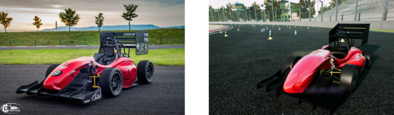
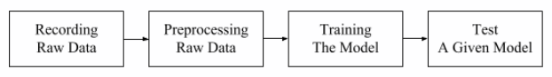

# Formula Student Technion Driverless - Based on AirSim

This project is about training and implementing self-driving algorithm for `Formula Student Driverless competitions`. In such competitions, a formula race car, designed and built by students, is challenged to drive through previously unseen tracks that are marked by traffic cones.

We present a simulator for formula student car and the environment of a driverless competition. The simulator is based on AirSim.

<p align="center">
    <br>
    Figure 1. The Technion Formula Student car. Actual car (left), simulated car (right)
</p>

The model of the Formula Student Technion car is provided by [Ryan Pourati](https://www.linkedin.com/in/ryanpo).

The environment scene is provided by [PolyPixel](https://www.polypixel3d.com/).

<p align="center">
    <br>
    Figure 2. Driving in real-world using trained imitation learning model, based on AirSim data only
</p>

## 1. Prerequisites

- Operating system: Windows 10
- GPU: Nvidia GTX 1080 or higher (recommended)
- Software: [Unreal Engine 4.18](https://www.unrealengine.com) and [Visual Studio 2017](https://my.visualstudio.com/Downloads?q=Visual%20Studio%202017) (see [upgrade instructions](https://github.com/Microsoft/AirSim/blob/master/docs/unreal_upgrade.md))
- Simulator: [AirSim 1.2](https://github.com/microsoft/AirSim/releases/tag/v1.2.0)

## 2. Build the AirSim Project

### 2.1. Install Unreal Engine

### 2.2. Build AirSim

1. You will need Visual Studio 2017 (**make sure** to install `VC++` and `Windows 8.1 SDK`).
2. Start `x64 Native Tools Command Prompt for VS 2017`. Create a folder for the repo and run `git clone https://github.com/Microsoft/AirSim.git`.
3. Run `build.cmd` from the command line. This will create ready to use plugin bits in the `Unreal\Plugins` folder that can be dropped into any Unreal project.

### 2.3. Creating and Setting Up Unreal Environment

Finally, you will need an `Unreal Project` that `hosts` the `environment` for your vehicles. Follow the list below to create an environment that simulates the FSD competitions.

1. Make sure `AirSim` is built and `Unreal 4.18` is installed as described above.

2. Open `Unreal Editor` and choose `New Project`. Choose `Blank` with `no starter content`. Select your project's location, define it's name (`ProjectName` for example) and press `create project`.

<p align="center">
    <br>
    Figure 3. Create Unreal Project
</p>

3. After the project is loaded to the editor, from the `File` menu select `New C++ class`, leave default None on the type of class, click `Next`, leave default name MyClass, and click `Create Class`. We need to do this because Unreal requires at least one source file in project. It should trigger compile and `open up Visual Studio` solution `ProjectName.sln`.

4. Close and save `ProjectName.sln`. Also, close the UE editor.

5. Go to your folder for `AirSim` repo and copy `Unreal\Plugins` folder into your `ProjectName` folder. This way now your own Unreal project has AirSim plugin.

6. Download the environment assets of [FSD racecourse](https://drive.google.com/file/d/1FC1T8rZ5hVEDXwlECnPxmPitRCLlxGma/view?usp=sharing). Extract the zip into `ProjectName\Content` (see folders tree at the end of this doc).

7. Download the formula Technion [car assets](https://drive.google.com/file/d/1dV4deyLlmMwBwA2ljxbardbGdXHtKKSo/view?usp=sharing). Extract the zip into `ProjectName\Plugins\AirSim\Content\VehicleAdv\SUV` and select `replace` when asked for `SuvCarPawn.uasset` (the original file will be saved into a backup folder).

8. `Edit` the `ProjectName.uproject` so that it looks like this:

```json
{
	"FileVersion": 3,
	"EngineAssociation": "4.18",
	"Category": "Samples",
	"Description": "",
	"Modules": [
		{
			"Name": "ProjectName",
			"Type": "Runtime",
			"LoadingPhase": "Default",
			"AdditionalDependencies": [
				"AirSim"
			]
		}
	],
	"TargetPlatforms": [
		"MacNoEditor",
		"WindowsNoEditor"
	],
	"Plugins": [
		{
			"Name": "AirSim",
			"Enabled": true
		}
	]
}
```

9. Right click the `ProjectName.uproject` in Windows Explorer and select `Generate Visual Studio project files`. This step detects all plugins and source files in your Unreal project and generates `.sln` file for Visual Studio.

<p align="center">
    <br>
    Figure 4. Generate Visual Studio project files
</p>

10. Reopen `ProjectName.sln` in Visual Studio, and make sure `DebugGame Editor` and `Win64` build configuration is the active build configuration.

<p align="center">
	<br>
	Figure 5. Build configurations
</p>

11. Press `F5` to `debug`. This will start the Unreal Editor. The Unreal Editor allows you to edit the environment, assets and other game related settings.

12. First thing, `load` a `map` to set your environment. The maps are under `Content\RaceCourse\Maps`. To choose one of the maps double-click on it.

13. In `Window/World Settings` as shown below, set the `GameMode Override` to `AirSimGameMode`:

<p align="center">
	<br>
	Figure 6. AirSimGameMode
</p>

14. Next, `if` you want to `change` the location of `PlayerStart` object in your environment(`PlayerStart` object already exist) you can find and fix it in the `World Outliner`. This is where AirSim plugin will create and place the vehicle. If its too high up then vehicle will fall down as soon as you press play giving potentially random behavior.

<p align="center">
	<br>
	Figure 7. PlayerStart position
</p>

15. Be sure to `Save` these edits. Hit the Play button in the Unreal Editor. See [how to use AirSim](https://github.com/Microsoft/AirSim/#how-to-use-it).

Ready... Set... GO!!! You are now running AirSim in your FSD Unreal environment.

## 3. How to Use It

### 3.1. Choosing the Mode: Car, Multirotor or ComputerVision

By default AirSim will prompt you for choosing Car or Multirotor mode. You can use [SimMode](https://github.com/Microsoft/AirSim/blob/master/docs/settings.md#simmode) setting to specify the default vehicle to car (Formula Technion Student car).

### 3.2. Manual drive

If you have a steering wheel (Logitech G920) as shown below, you can manually control the car in the simulator. Also, you can use arrow keys to drive manually.

[More details](https://github.com/Microsoft/AirSim/blob/master/docs/steering_wheel_installation.md)

<p align="center">
    <br>
    Figure 8. Manual drive
</p>

### 3.3. Steering the car using imitation learning

Using imitation learning, we trained a deep learning model to steer a Formula Student car with an input of only one camera. Our code files for the training procedure are available [here](https://github.com/FSTDriverless/AirSim/tree/master/PythonClient/imitation_learning) and are based on [AirSim cookbook](https://github.com/Microsoft/AutonomousDrivingCookbook).

### 3.4. Gathering training data

We added a few [graphic features](https://github.com/Microsoft/AirSim/wiki/graphic_features) to ease the procedure of recording data.
You can change the positions of the cameras using [this tutorial](https://github.com/Microsoft/AirSim/wiki/cameras_positioning).

There are two ways you can generate training data from AirSim for deep learning. The easiest way is to simply press the record button on the lower right corner. This will start writing pose and images for each frame. The data logging code is pretty simple and you can modify it to your heart's desire.

<p align="center">
    <br>
    Figure 9. Gathering training data
</p>

## 4. Imitation Learning

This section is about training a model to steer our Formula car using imitation learning.

Imitation learning includes the usage of labeled data as input to a training algorithm with the purpose of having the algorithm imitate the actions of people who recorded the data.

<p align="center">
	<br>
	Figure 10. Imiation Learning diagram
</p>

### 4.1. Preparing training dataset

`cook_data.py` is responsible for preparing `.h5` dataset files for the training procedure.

The code rely on having two adjacent folders:
`raw_data` - contains folders of recorded data by airsim's recording method.
`cooked_data` - empty folder to store the .h5 files.

The flag "COOK_ALL_DATA" gives the option to choose all subfolders, or exclude some of them.

### 4.2. Training

`train_model.py` is responsible to train a model using the .h5 dataset files.
The code rely on having two adjacent folders:

`cooked_data` - contains the .h5 dataset files.
`models` - empty folder to store the generated models.

The file will preprocess the data, add augmentations and create a neural network model that predicts the next steering angle.

### 4.3. Driving using a trained model

`drive_model.py` connects to the simulation in order to upload a trained model and drive using it.

By using the predicted steering value, the code calculates related control parameters and maintain driving with steady velocities.

## 5. Training Tips

I recommend on using augmentation and recording techniques:

- [CycleLight](https://github.com/FSTDriverless/AirSim/blob/master/docs/graphic_features.md) - Animation of a day light cycle in a changeable, potentially very short period of time.
- Shifted images - Altering the camera’s position to the right or the left of the car, so that it can record images in extreme conditions. To simulate driving back to the center from those extreme situations, post-process the recorded angle of the steering accordingly (manually).


## References

[Build AirSim with FST Driverless Environment on Windows](https://github.com/Microsoft/AirSim/wiki/build_FSTDriverless_windows#install-unreal-engine)
